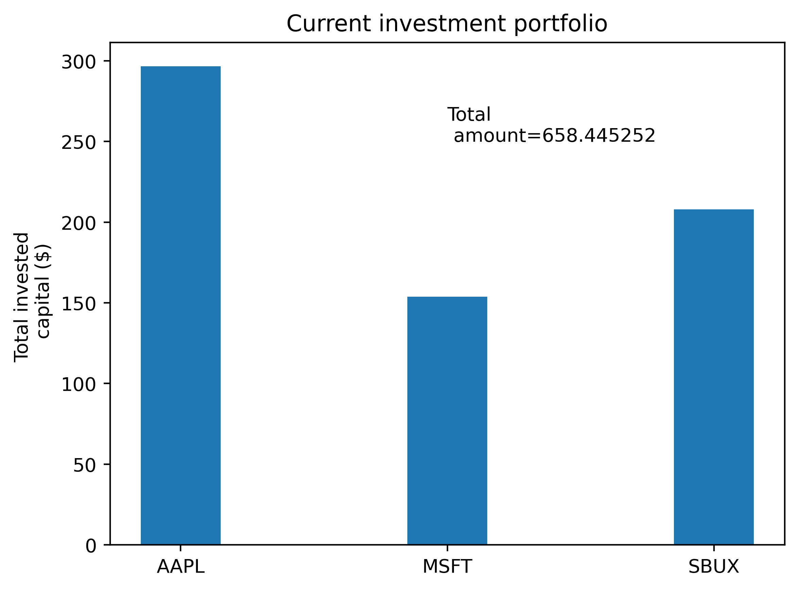

# Stock Market

A python implementation for computing the necessary amount ($) to invest in a specific stock market based on the desired fractional share.

## Workflow

The goal of the project is to calculate the portfolio value (in USD) based on the invested stocks and their current market price. Available shares are given as input for each company. Using `yfinance` package, one can get the current market price of each company.

The companies are given as input strings into an array (e.g., `['MSFT','APPL,'SBUX']`), and using `Ticker` method within the Yahoo financial package, the *highest price of the day* can always be available via the call `float(stock_value.info['regularMarketDayHigh'])`. Conversion to `float` is done for further computations. Using the current market price and the available shares, it is straightforward to compute the total portfolio value.

As an additional step in the project is the compute the required amount for reaching a desired share amount per company. This is based on a constant value `OPTIMAL_SHARE` that represents the total shares desired, and then, by performing a proper computational workflow, the required amount is readily obtained.

Graphical representations under the form of *bar-charts* are made using `matplotlib`.

Example with the final result of a plot can be seen in the figure below.

## Issues

The `xz` package was missing and the execution of a python script that had `yfinance` package couldn't execute properly. Solution was found [here](https://stackoverflow.com/questions/57743230/userwarning-could-not-import-the-lzma-module-your-installed-python-is-incomple). The `xz` package was installed via Homebrew.
